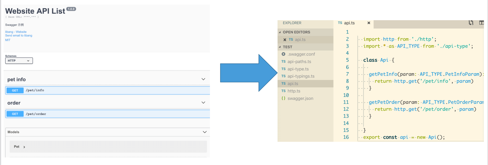
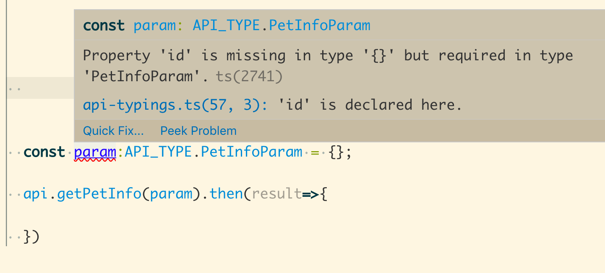
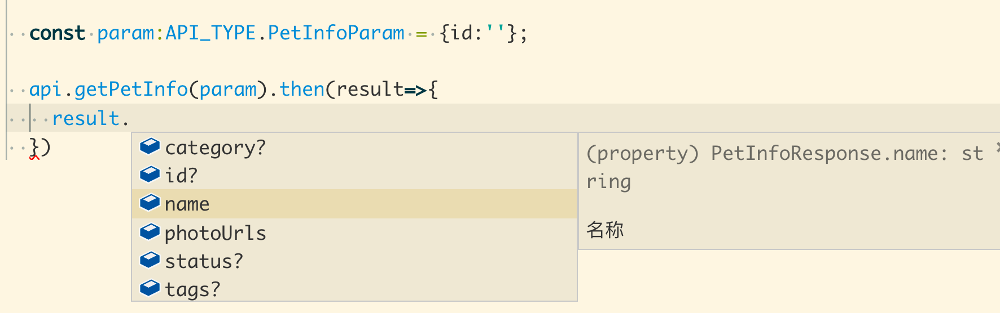

### 利用Swagger生成TypeScript interface代码

#### 简介
&emsp;&emsp;作为一款API文档工具，Swagger已经广泛应用于程序开发中。通过Swagger衍生出的一系列项目和工具，也极大的方便了我们的开发。

&emsp;&emsp;我们知道Swagger详细描述了项目中所有的请求路径、入参、返回数据。对于前端开发者来说，完全可以通过这份文档生成一份实际可用的代码用于项目。如果恰好你也在使用TypeScript：请求方法以及所有请求的入参、返回数据的定义都可以通过这个工具自动生成。



#### 使用
&emsp;&emsp;一份Swagger文件通过本工具会转成项目请求的通用代码：
> + api.ts            所有请求代码
> + http.ts           基于axios封装的http请求
> + api-typings.ts    所有请求入参、返回数据的typings定义，自动生成，不可手动修改
> + api-type.ts       导入api-typings中的定义，可自定义修改，对外使用
> + api-paths.ts      所有请求入参、返回数据的json schema定义

&emsp;&emsp;我们来详细看一下生成的代码：
```
  import http from './http';
  import * as API_TYPE from './api-type';

  class Api {
    
    getPetInfo(param: API_TYPE.PetInfoParam): Promise<API_TYPE.PetInfoResponse> {
      return http.get('/pet/info', param)
    }
  
    getPetOrder(param: API_TYPE.PetOrderParam): Promise<API_TYPE.PetOrderResponse> {
      return http.get('/pet/order', param)
    }
  
  }
  export const api = new Api();

```
&emsp;&emsp;由Swagger文档定义好的http请求代码已经自动生成，我们可以根据自己的需要使用：

1.定义了空的入参，编辑器根据typings定义提醒我们缺少id：


2.传入正确的参数，请求结果字段自动提示:


#### 安装

```cnpm i -g swaggts```


#### 已知待完善功能：
~~+ 只支持get、post请求~~
+ 复杂请求url未做处理