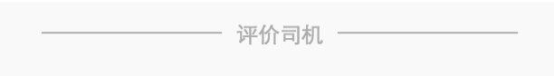

### 一道简单的CSS题目

#### 题目
&emsp;请实现如下布局，要求自适应各种移动端浏览器



&emsp;在很久之前的实际开发中，处理过同样的问题，当时的第一直觉是使用css的伪元素来解决。但是实际写起来，却不是那么好处理，有很多问题要考虑，比如：怎么画出适应各端的1px的线，怎么实现线与文字的垂直方向居中等等。并且纯css画线，一不小心就会把代码写复杂。

#### 解决方案
&emsp; 最终在经过一番思索考量之后，当时我给出的解决方法是利用background来实现，废话不多说，直接上代码：

```
// html 结构
<div class="c-title">
    <p>
        <span>评价司机</span>
    </p>
</div>
// less 样式
.c-title{
    p{
        text-align: center;
        background: url(../../assets/1px.png) center repeat-x;
        span{
            background-color: #f5f5f5; // 背景色遮住背后的线
            padding: 4px 20px; // 设置合适的文字间隔
            color: #333333;
        }
    }
}
```
&emsp;直接截取一个1px的小图，利用 repeat-x 重复加 center 背景居中，来让直线在垂直方向上贯穿文字，我们甚至连一个css3的属性都没用，所以它的兼容性是非常好的。html结构没有任何多余，就算没有相应的css，默认显示都适合浏览。唯一的缺点就是需要截取一张图片。

#### 天猫的解决方案

&emsp;ok，说完了我们的解决方案，我们来看一下天猫是怎么处理这个问题的：


```
// html结构
<div class="c-title">热门造型清单</div>
// css样式
c-title {
    display: block;
    line-height: 2.93333rem;
    font-size: 0.86667rem;
    color: #333;
    text-align: center;
    font-weight: bolder;
}
.c-title:before, .c-title:after {
    content: '';
    width: 1.53333rem;
    height: 0.06667rem;
    background-color: #D9D9D9;
    margin: 0 0.26667rem;
    display: inline-block;
    vertical-align: middle;
}
```
&emsp;通过css伪元素来解决，可以通过vertical-align来解决垂直方向居中的问题，这个方案也很好，但是问题是如果不通过使用px2rem这样的插件，相应rem的值如何计算，是比较麻烦的，且根本无法人工对这些rem值进行后续的改动。

